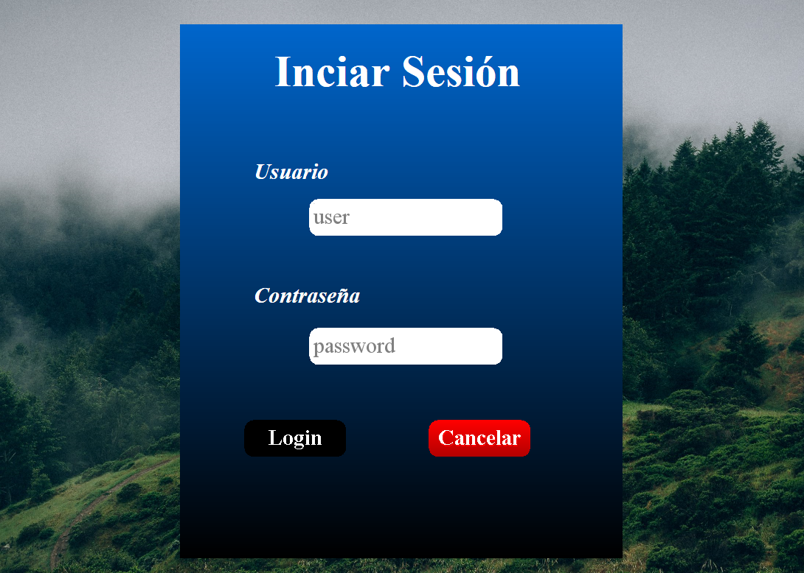
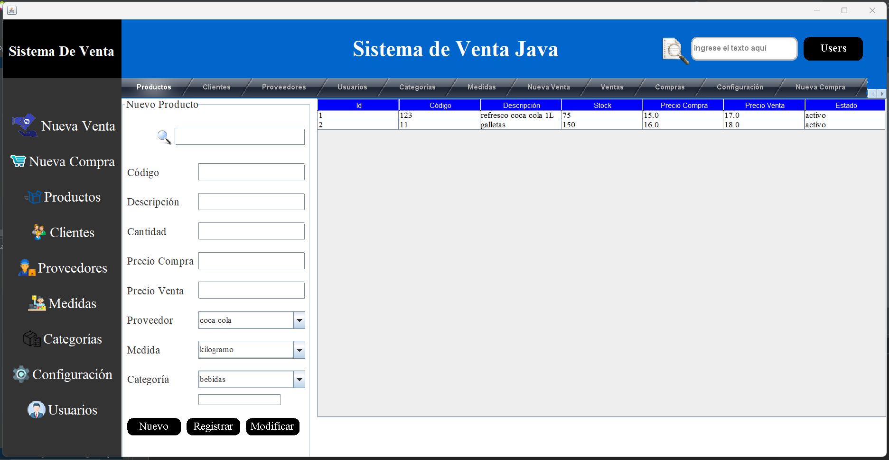
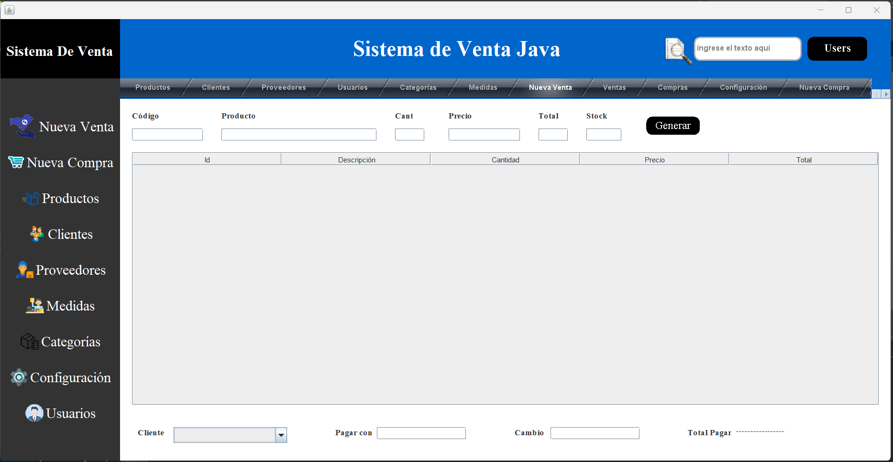

# PuntoDeVenta-java

Descripción:
Sistema de venta con java y MySQL.
Este sistema se creo usando la arquitectura MVC, uso de POO en java, uso de Base de Datos en MySQL.

Dentro de las características de uso del sistema se encuentran: login para inicio de sesión,
las secciones con CRUD para ventas, compras, productos, clientes, proveedores, medidas de productos,
categorías, configuración y gestión de usuarios.

